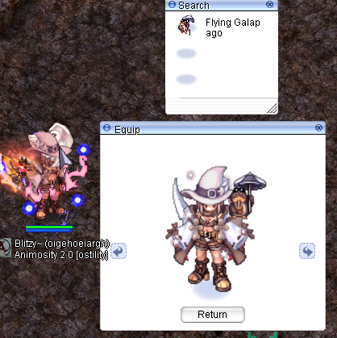

# Leveling: Archer

After following [starter guide](starter-guide.md), you can go to Warper to teleport to the following dungeons/fields:

<table><thead><tr><th width="160">Dungeon/Field</th><th width="86">Base level</th><th width="121.9998779296875">What kill?</th><th>Note</th></tr></thead><tbody><tr><td>Anthell</td><td>0-15</td><td>Eggs</td><td>Add all your stat points into dex. After you reach 10 job level, go to Prontera to talk with <a href="prontera-town.md#job-master">Job Master</a></td></tr><tr><td>Anthell</td><td>15-35</td><td>Eggs/Ants</td><td>Kill ants that are alone by type or far. Add all your stat points into agi</td></tr><tr><td>Orc dungeon 1</td><td>30-40</td><td>All</td><td>Except plants, kill every mob.</td></tr><tr><td>Einbroch Field 4</td><td>40-60</td><td>Geographer</td><td>With fire arrows kill <a href="https://ratemyserver.net/index.php?mob_name=geographer&#x26;page=mob_db&#x26;quick=1&#x26;f=1&#x26;mob_search=Search">geographers</a> that are alone. They use to heal on other monsters so can heal each other if they are enough near</td></tr><tr><td>Payon Dungeon 2</td><td>40-60</td><td>All</td><td><a href="https://ratemyserver.net/index.php?mob_name=Archer+Skeleton&#x26;page=mob_db&#x26;quick=1&#x26;f=1&#x26;mob_search=Search">Archer Skeleton</a> should be your primary target. They drop an apple of archer that you must equip.</td></tr><tr><td>Comodo Field 3</td><td>61-89</td><td>Anolian</td><td>Focus on <a href="https://ratemyserver.net/index.php?mob_name=Anolian&#x26;page=mob_db&#x26;quick=1&#x26;f=1&#x26;mob_search=Search">Anolian</a> to obtain 2 [brooch<a href="https://ratemyserver.net/index.php?iname=2625&#x26;page=item_db&#x26;quick=1&#x26;isearch=Search">1</a>]. Equip wind arrows</td></tr><tr><td>Moscovia Dungeon 3</td><td>61-89</td><td>Mavka</td><td>Focus on <a href="https://ratemyserver.net/index.php?mob_name=1884&#x26;page=mob_db&#x26;quick=1&#x26;f=1&#x26;mob_search=Search">Mavka</a>. Equip fire arrows</td></tr><tr><td>Thor Dungeon (Level 1)</td><td>90+</td><td>Kasa</td><td>Equip water arrow and Frozen Bow. Equip Abysmal Knight Card for extra 25% damage (Kasa is considered mini MVP). Make sure to wear Fire Armor</td></tr><tr><td>Abyss Lake</td><td>90+ </td><td>All dragons</td><td>Bring Holy and Shadow arrow to swap</td></tr><tr><td>Rachel Sanctuary (Level 5)</td><td>90+</td><td>Agav and Echio</td><td>Ideal setup is Hunting Bow + Hunting Arrow.   End game setup is Bounty Bow + Bounty Elements</td></tr><tr><td>Byalan Dungeon (Level 6)</td><td>90+</td><td>All water monsters</td><td>Bring Wind Arrow and Gust Bow.</td></tr><tr><td>Thor Dungeon Level 3)</td><td>130+</td><td>Kasa and Salamander</td><td>Same setup as Thor Dungeon (Level 1)</td></tr><tr><td>Odin Temple (Level 3)</td><td>130+</td><td>Valkyrie, Skeggiold</td><td>Bring Shadow Arrow for Skeggiold and Holy Arrow for Frus/ Skogul</td></tr></tbody></table>

## Build from newbie to hero

### Beginner Builds

At the start, without zeny and coin (like me!), the only way to make equipment is to make base equipment.

#### Equipment list - Auto Bolter

* **Headgear High**: Apple of Archer --> Little Lunar Rainbow --> Then Upgrade to Lunar Rainbow eventually

<figure><figcaption></figcaption></figure>

* **Headgear lower:** Flying Galapago

Increases Blitz Beat up to 400% (40% per level of Blitz Beat) and increases chance of Blitz Beat

<figure><figcaption></figcaption></figure>

* **Weapon:** +7 Proton Bow
* **Armor:** +4 Pantie
* **Garment:** +4 Undershirt --> Upgrade to Adventurer's backpack eventually
* **Shoes:** +4 any shoes
* **Cards for brooch\[1]:** 1 x Owl Duke Card, 1 x Owl Baron Card

#### Stats:

* **Agi:** 90 - 120
* **Dex:** 80 - 100
* **Luk:** 90

Adjust stats to get 193 ASPD with minimum status point investment in AGI and DEX. Also **Improve concentration** skill increases ASPD so you can decide to not use only points to get 193 ASPD

The remaining points will be useful to:

* LUK for extra falcon activation. Every 3 LUK = 1% chance
* INT for extra falcon damage (not against crystal)

#### Equipment list - Double Strafe

* **Headgear High**: +4 Apple of Archer --> Upgrade to Laser of Eagle
* **Weapon:** Any Elemental Bow --> Upgrade to Bounty Bow

<figure><figcaption></figcaption></figure>

* **Armor:** Tights \[1] --> Upgrade to Bounty Elements + 200% Double Strafe with Bounty Bow

<figure><figcaption></figcaption></figure>

* **Garment:** +4 Undershirt \[1] --> Upgrade to Adventurer's Backpack
* **Shoes:** +4 any shoes&#x20;
* **Brooch \[1]** or **Gloves \[1]**

**Cards:** Dragon Tail Card, Merman Card, Anolian Card, Alligator Card & Cruiser Card combo

#### Stats:

* **Agi:** 90 - 120
* **Dex:** 80 - 100

Adjust stats to get 193 ASPD with minimum status point investment in AGI and DEX. Also **Improve concentration** skill increases ASPD so you can decide to not use only points to get 193 ASPD

The remaining points will be useful to:

* INT for a bit more SP to double strafe
* LUK for a bit more attack and hit rate

